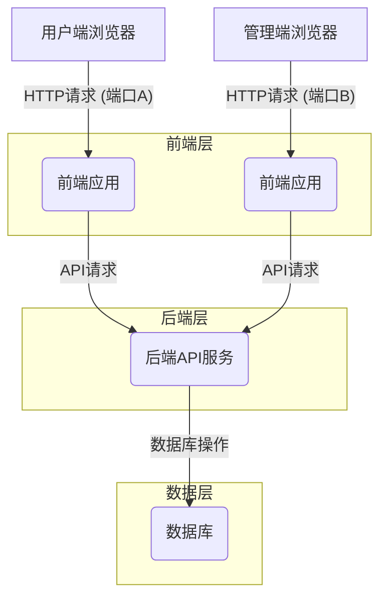
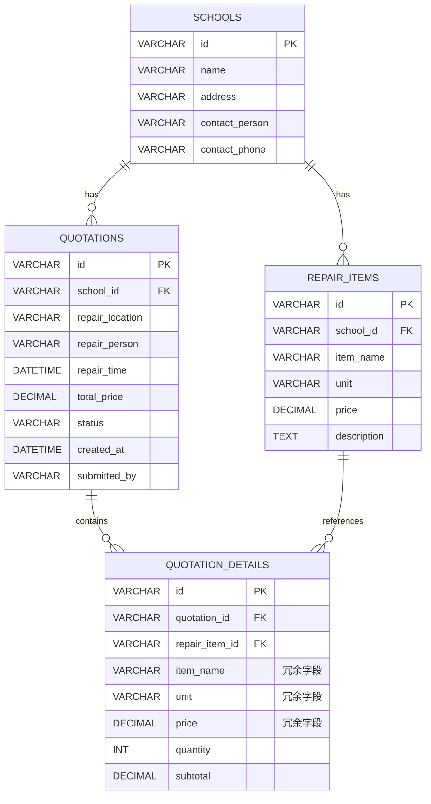

# 维修上报系统开发文档

## 1. 引言

本文档旨在详细描述维修上报系统的开发方案，包括系统概述、功能需求、非功能需求、系统架构、技术选型、数据库设计、前后端模块设计、部署方案以及安全考虑。本系统旨在提供一个便捷的平台，用于管理不同学校或场所的维修项目报价和维修上报流程。

## 2. 系统概述

维修上报系统是一个B/S架构的应用程序，分为用户端和管理端。用户端主要面向需要提交维修申请的终端用户，管理端则面向负责维修项目管理和计价单处理的管理员。系统支持响应式设计，能够自动适配手机端和电脑端，提供轻量化、美观的用户体验。

### 2.1 系统目标

*   提供用户友好的界面，方便用户快速选择维修项目并生成计价单。
*   实现维修项目价目表的灵活管理，支持不同学校/区域的差异化定价。
*   简化计价单的提交和管理流程，提高工作效率。
*   支持计价单的查询和批量导出，方便数据分析和归档。
*   确保系统在不同设备上的良好可用性。

### 2.2 系统角色

*   **用户端用户**: 无需登录，可访问用户端功能，提交维修计价单。
*   **管理端用户**: 无需登录，可访问管理端功能，管理维修项目和计价单。

## 3. 功能需求

### 3.1 用户端功能

*   **学校/区域选择**: 用户可以选择需要维修的学校或区域。
*   **维修项目动态加载与选择**: 根据选择的学校/区域，动态加载对应的维修项目列表。维修项目列表应支持上下滑动浏览，方便用户选择。
*   **维修项目添加**: 用户选择维修项目后，输入数量，点击"添加"按钮，将项目添加到计价单中。支持添加多个维修项目。
*   **维修信息填写**: 用户手动输入维修地点、维修人员，并选择维修时间。
*   **计价单生成与预览**: 根据选择的维修项目、数量和填写的维修信息，自动生成包含详细清单和总价的计价单，并提供预览功能。
*   **计价单提交**: 用户确认计价单无误后，点击"提交"按钮，将计价单提交到后台。

### 3.2 管理端功能

*   **维修项目管理**: 
    *   **批量导入**: 支持从CSV文件批量导入维修项目价目表。导入时，管理员需先输入区域名称，然后上传对应的CSV文件，系统将自动把数据写入数据库，并将本次上传的维修项目归属于该区域。
    *   **增删改查**: 对学校/区域、维修项目进行增加、删除、修改、查询操作。
*   **计价单管理**: 
    *   **查询**: 支持按学校、按时间段查询用户提交的计价单。
    *   **批量导出**: 支持将查询到的计价单批量导出为Excel文件，每个计价单在Excel中占一行。
    *   **计价单详情查看**: 查看单个计价单的详细信息。

## 4. 非功能需求

*   **响应式设计**: 系统界面应自动适配手机端和电脑端，提供良好的用户体验。
*   **性能**: 系统应具备良好的响应速度，尤其是在加载大量维修项目时。
*   **可用性**: 界面设计应简洁、直观，操作流程清晰。
*   **安全性**: 尽管无需登录，但仍需考虑数据传输安全（如HTTPS）和API访问控制。
*   **轻量化**: 框架选择和界面设计应遵循轻量化原则，避免不必要的复杂性。

## 5. 系统架构

本系统采用前后端分离的B/S架构，具体如下：

*   **前端**: 负责用户界面展示和用户交互逻辑。
*   **后端**: 提供RESTful API接口，处理业务逻辑、数据存储和文件操作。
*   **数据库**: 负责数据持久化存储。

### 5.1 架构图

## 6. 技术选型

### 6.1 前端技术栈

*   **框架**: Vue.js 3
    *   **理由**: Vue.js 3 是一款轻量级、高性能的渐进式JavaScript框架，易于学习和上手，生态系统成熟，组件化开发模式有助于构建可维护的用户界面。其响应式特性和虚拟DOM使其在处理大量数据时表现良好，符合轻量化和美观界面的要求。
*   **UI组件库**: Element Plus
    *   **理由**: Element Plus 是基于 Vue 3 的一套桌面端组件库，提供丰富的UI组件，风格简洁美观，支持响应式布局，能够加速开发并确保界面一致性。
*   **状态管理**: Pinia
    *   **理由**: Pinia 是 Vue 官方推荐的状态管理库，相比Vuex更轻量、更简单，且支持TypeScript，非常适合中小型项目。
*   **路由**: Vue Router
    *   **理由**: Vue Router 是 Vue.js 官方的路由管理器，与Vue.js 深度集成，用于实现单页面应用的路由管理。
*   **构建工具**: Vite
    *   **理由**: Vite 是一款由Vue.js作者开发的下一代前端构建工具，提供极速的开发服务器启动和热模块更新，显著提升开发效率，且打包后的文件体积小，符合轻量化要求。

### 6.2 后端技术栈

*   **语言/框架**: Node.js + NestJS
    *   **理由**: Node.js 具有高性能和事件驱动的特性，适合构建高并发的API服务。NestJS 是一个基于TypeScript的渐进式Node.js框架，它结合了面向对象编程、函数式编程和响应式编程的元素，提供了良好的模块化和可扩展性，易于维护和测试。其架构清晰，开发效率高，且Node.js本身部署相对轻量。
*   **数据库连接**: TypeORM
    *   **理由**: TypeORM 是一个强大的ORM（对象关系映射）工具，支持TypeScript和多种数据库，能够简化数据库操作，提高开发效率，并提供类型安全。
*   **Excel处理**: exceljs
    *   **理由**: exceljs 是一个用于读写Excel文件的Node.js库，功能强大且易于使用，能够满足维修项目批量导入和计价单批量导出的需求。

### 6.3 数据库

*   **类型**: 关系型数据库
*   **选择**: MySQL 8.x
    *   **理由**: MySQL 是目前最流行的开源关系型数据库之一，具有成熟稳定、性能良好、社区支持丰富、易于部署和管理的特点，非常适合本项目的需求，且符合轻量化部署的考量。

## 7. 数据库设计

### 7.1 实体关系图 (ERD)

### 7.2 表结构详情

#### `schools` (学校/区域表)

| 字段名          | 数据类型    | 约束     | 描述             |
| :-------------- | :---------- | :------- | :--------------- |
| `id`            | `VARCHAR(36)` | `PK`     | 主键，UUID       |
| `name`          | `VARCHAR(255)`| `NOT NULL` | 学校/区域名称    |
| `address`       | `VARCHAR(500)`|          | 地址             |
| `contact_person`| `VARCHAR(100)`|          | 联系人           |
| `contact_phone` | `VARCHAR(20)` |          | 联系电话         |

#### `repair_items` (维修项目表)

| 字段名          | 数据类型    | 约束     | 描述                 |
| :-------------- | :---------- | :------- | :------------------- |
| `id`            | `VARCHAR(36)` | `PK`     | 主键，UUID           |
| `school_id`     | `VARCHAR(36)` | `FK`     | 关联 `schools` 表的ID |
| `item_name`     | `VARCHAR(255)`| `NOT NULL` | 维修项目名称         |
| `unit`          | `VARCHAR(50)` |          | 单位 (如：个、次、米) |
| `price`         | `DECIMAL(10,2)`| `NOT NULL` | 单价                 |
| `description`   | `TEXT`        |          | 项目描述             |

#### `quotations` (计价单表)

| 字段名          | 数据类型    | 约束     | 描述                 |
| :-------------- | :---------- | :------- | :------------------- |
| `id`            | `VARCHAR(36)` | `PK`     | 主键，UUID           |
| `school_id`     | `VARCHAR(36)` | `FK`     | 关联 `schools` 表的ID |
| `repair_location`| `VARCHAR(500)`| `NOT NULL` | 维修地点             |
| `repair_person` | `VARCHAR(100)`| `NOT NULL` | 维修人员             |
| `repair_time`   | `DATETIME`    | `NOT NULL` | 维修时间             |
| `total_price`   | `DECIMAL(10,2)`| `NOT NULL` | 总价                 |
| `status`        | `VARCHAR(50)` | `DEFAULT '待处理'` | 计价单状态 (待处理、已完成等) |
| `created_at`    | `DATETIME`    | `NOT NULL` | 创建时间             |
| `submitted_by`  | `VARCHAR(100)`|          | 提交人 (可选)        |

#### `quotation_details` (计价单明细表)

| 字段名          | 数据类型    | 约束     | 描述                 |
| :-------------- | :---------- | :------- | :------------------- |
| `id`            | `VARCHAR(36)` | `PK`     | 主键，UUID           |
| `quotation_id`  | `VARCHAR(36)` | `FK`     | 关联 `quotations` 表的ID |
| `repair_item_id`| `VARCHAR(36)` | `FK`     | 关联 `repair_items` 表的ID |
| `item_name`     | `VARCHAR(255)`| `NOT NULL` | 维修项目名称 (冗余)  |
| `unit`          | `VARCHAR(50)` |          | 单位 (冗余)          |
| `price`         | `DECIMAL(10,2)`| `NOT NULL` | 单价 (冗余)          |
| `quantity`      | `INT`         | `NOT NULL` | 数量                 |
| `subtotal`      | `DECIMAL(10,2)`| `NOT NULL` | 小计                 |

## 8. 前后端模块设计

### 8.1 前端模块设计

#### 8.1.1 用户端

*   **页面**: 
    *   `index.html` (或 `App.vue`/`App.jsx`): 主入口页面。
    *   `QuotationForm.vue`/`QuotationForm.jsx`: 计价单填写表单，包含学校选择、项目选择、数量输入、维修信息填写等。
    *   `QuotationPreview.vue`/`QuotationPreview.jsx`: 计价单预览组件。
*   **组件**: 
    *   `SchoolSelector`: 学校/区域选择器。
    *   `RepairItemPicker`: 维修项目选择器，支持滚动加载和搜索。
    *   `QuotationItemList`: 计价单项目列表，显示已添加的项目。
    *   `DatePicker`: 维修时间选择器。
*   **API服务**: 封装对后端API的调用，如获取学校列表、获取维修项目、提交计价单等。

#### 8.1.2 管理端

*   **页面**: 
    *   `admin.html` (或 `AdminApp.vue`/`AdminApp.jsx`): 管理端主入口页面。
    *   `SchoolManagement.vue`/`SchoolManagement.jsx`: 学校/区域管理页面。
    *   `RepairItemManagement.vue`/`RepairItemManagement.jsx`: 维修项目管理页面，包含导入功能。
    *   `QuotationManagement.vue`/`QuotationManagement.jsx`: 计价单查询和导出页面。
*   **组件**: 
    *   `TableComponent`: 通用表格组件，用于数据展示。
    *   `FormDialog`: 通用表单弹窗，用于增删改操作。
    *   `FileUpload`: 文件上传组件，用于Excel导入。
    *   `DateRangePicker`: 日期范围选择器，用于计价单查询。
*   **API服务**: 封装对后端API的调用，如学校/项目增删改查、计价单查询/导出等。

### 8.2 后端API设计

后端API将遵循RESTful原则，提供JSON格式的数据交互。

#### 8.2.1 学校/区域相关API

*   `GET /api/schools`: 获取所有学校/区域列表。
*   `POST /api/schools`: 新增学校/区域。
*   `PUT /api/schools/{id}`: 更新学校/区域信息。
*   `DELETE /api/schools/{id}`: 删除学校/区域。

#### 8.2.2 维修项目相关API

*   `GET /api/repair-items?schoolId={schoolId}`: 根据学校ID获取维修项目列表。
*   `POST /api/repair-items`: 新增维修项目。
*   `PUT /api/repair-items/{id}`: 更新维修项目信息。
*   `DELETE /api/repair-items/{id}`: 删除维修项目。
*   `POST /api/repair-items/import`: 批量导入维修项目 (上传Excel文件)。

#### 8.2.3 计价单相关API

*   `POST /api/quotations`: 用户提交计价单。
*   `GET /api/quotations?schoolId={schoolId}&startDate={startDate}&endDate={endDate}`: 管理端查询计价单列表。
*   `GET /api/quotations/{id}`: 获取单个计价单详情。
*   `GET /api/quotations/export?schoolId={schoolId}&startDate={startDate}&endDate={endDate}`: 批量导出计价单为Excel。

## 9. 部署方案

### 9.1 开发环境

*   **前端**: Node.js, npm/yarn
*   **后端**: Java JDK/Node.js/Python环境，Maven/Gradle/npm/pip
*   **数据库**: MySQL/PostgreSQL本地安装或Docker容器

### 9.2 生产环境

*   **服务器**: Linux服务器 (如 CentOS, Ubuntu)
*   **Web服务器**: Nginx (用于反向代理和静态资源服务)
*   **应用部署**: 
    *   **前端**: 将编译后的前端静态文件部署到Nginx。
    *   **后端**: 将后端服务打包成可执行JAR/WAR包或Docker镜像，部署到服务器上。
*   **数据库**: 独立的数据库服务器或云数据库服务。
*   **端口配置**: 
    *   Nginx配置：将用户端域名/IP:端口A指向用户端前端静态文件。
    *   Nginx配置：将管理端域名/IP:端口B指向管理端前端静态文件。
    *   后端API服务可以运行在默认端口（如8080），Nginx再进行反向代理。

## 10. 安全考虑

尽管系统无需登录，但仍需关注以下安全方面：

*   **HTTPS**: 强制使用HTTPS协议进行所有数据传输，保护数据在传输过程中的安全和完整性。
*   **CORS配置**: 后端API严格配置CORS，只允许来自指定前端域名的请求，防止跨域攻击。
*   **输入验证**: 前后端都必须对所有用户输入进行严格的验证和过滤，防止SQL注入、XSS攻击、文件上传漏洞等。
*   **API访问控制**: 对于管理端API，可以考虑基于IP白名单、API Key或其他简单令牌机制进行访问限制，防止未经授权的访问。
*   **错误处理**: 避免在错误信息中暴露敏感系统信息。
*   **依赖安全**: 定期更新项目依赖，修复已知安全漏洞。
*   **数据备份**: 定期对数据库进行备份，防止数据丢失。

## 11. 总结

本开发文档详细阐述了维修上报系统的整体设计方案。通过采用现代化的前后端分离架构和响应式设计，系统将能够提供高效、便捷、美观的用户体验。后续将根据此文档进行详细开发和实现。
